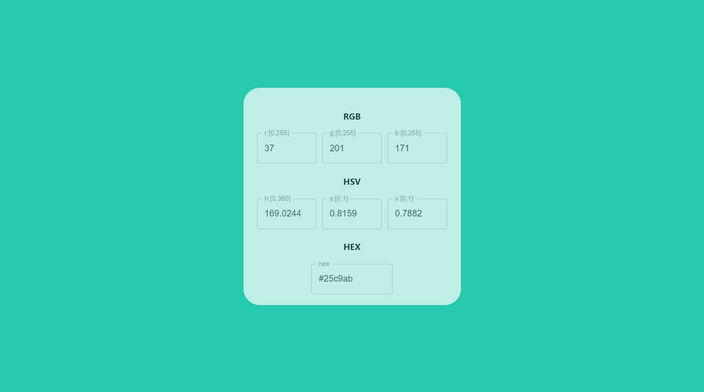
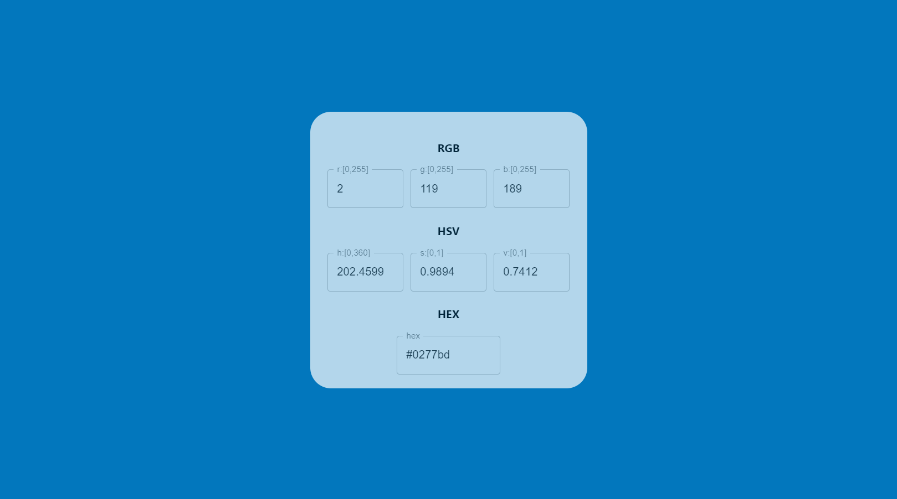

# Color Convert

Easy color convert, rgb and hex and hexadecimal.

You can access through this address:

https://httpsbao.github.io/color-convert/

- You can enter the color numbers in the input box
- I used GitHub Actions to automatically publish the project.

### Deveploment

In the project directory, you can run: `npm start` to develop

